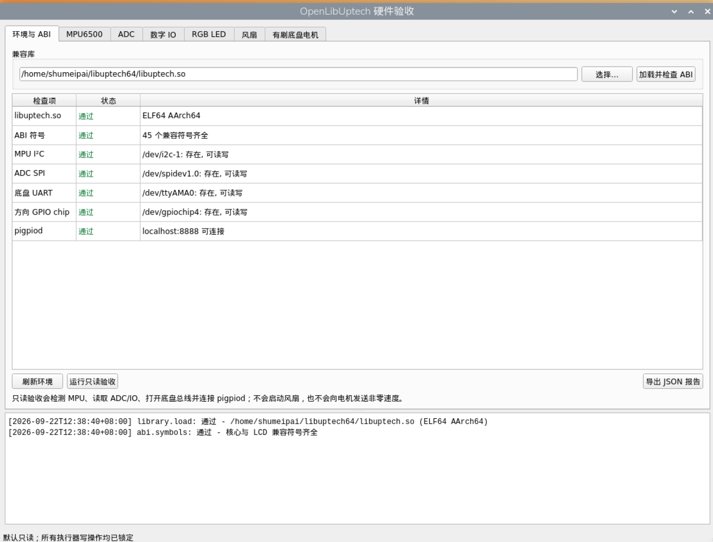

# OpenLibUptech / libuptech64

> ARM32 libuptech.so → AArch64/64-bit Raspberry Pi compatibility port

## 中文

### 这是什么

OpenLibUptech 是对旧版 UpTech/TechStar 机器人系统中 libuptech.so 的开源兼容复刻。原系统提供的是 32 位 ARM 用户态库；本项目根据原有系统镜像中的 ARM32 ELF、Python 封装、导出 ABI 和实际硬件协议，重新实现了一个可在 64 位 Raspberry Pi OS 上运行的 ELF64 AArch64 版本。

项目目标是让仍然使用旧 UpTech 扩展板和底盘控制器的人，不必继续依赖只能在 32 位系统上运行的闭源库。它保留原库的函数名和调用约定，尽量保持旧版 pyuptech / uptech.py 的使用方式，同时把底层实现换成可审计、可编译的 C 源码。

本仓库不包含、不重新发布原厂专有 ARM32 镜像或原始二进制。它是基于原系统行为和协议进行的兼容性实现，不是原厂源码的声称或替代授权。

### 适合谁

- 手里有旧版 32 位树莓派镜像，但希望迁移到 64 位系统；
- 需要继续使用 UpTech ADC/IO 扩展板、MPU6500、CDS 总线或底盘电机；
- 想搜索 libuptech.so、pyuptech、UpTech、TechStar、AArch64 兼容库；
- 希望先保留旧镜像作为回滚，再逐项验证硬件，而不是一次性替换整套系统。

### 兼容性概览

| 项目 | 原系统 | 本项目 |
| --- | --- | --- |
| 用户态库 | ARM32 libuptech.so | ELF64 AArch64 libuptech.so |
| Python 生态 | pyuptech / uptech.py | 保留主要 C ABI，可继续由 ctypes 调用 |
| ADC/IO SPI | pigpio SPI 通道 | Linux /dev/spidev1.0 |
| 底盘总线 | /dev/ttyAMA0，GPIO4 半双工方向 | 同一设备节点和协议 |
| IMU | I²C1，MPU6500 兼容器件 | 同一总线和地址 |
| 风扇 | Python pigpio | pigpiod + GPIO18 服务/GUI |

### 已实现功能

#### ADC、数字 IO 和 RGB LED

- /dev/spidev1.0，SPI mode 0，1 MHz；
- 9 路外部 ADC：ADC0–ADC8；
- 原 ABI 保留第 10 个 uint16_t 返回值，用于板载电源电压采样；
- 8 路数字 IO：输入电平读取、输入/输出模式设置、单路和批量输出；
- 两颗 RGB LED，索引 0 和 1，支持 24 位 RGB 颜色；
- ADC 返回帧按原库的小端字节顺序解码。

#### CDS 总线和有刷底盘电机

- /dev/ttyAMA0，1 Mbps、8N1；
- GPIO4 控制半双工收发方向；
- 保留 cds_servo_* 名称，因为它们属于原厂 ABI；
- 实际底盘执行器是有刷电机，不是舵机；当前验收中 ID7 为左轮、ID8 为右轮；
- 支持连续转动模式、速度、角度、寄存器读取和原始帧接口；
- GUI 对右轮做方向取反，速度输入为 0..1024，协议最大有效幅值为 1023。

#### MPU6500 兼容 IMU

- /dev/i2c-1，默认地址 0x68；
- 接受 WHO_AM_I=0x70 或 0x68；
- 原始三轴加速度和三轴陀螺仪读取；
- 加速度/陀螺仪量程读取与设置；
- 基础初始化和设备健康检查。

#### 风扇控制

风扇不属于 libuptech.so ABI，而是由 pigpiod 和 GPIO18 控制：

- 0% 和 100% 使用持续低/高电平；
- 1%–99% 使用 800 Hz PWM；
- uptech-fan.service 会在每次开机后把风扇设置为 800 Hz、80% PWM；
- pigpiod.service 只监听本机，避免把控制接口暴露到网络。

#### PyQt6 硬件验收界面

acceptance_gui.py 提供以下页面：

- 环境与 ABI；
- MPU6500；
- ADC；
- 数字 IO；
- RGB LED；
- 风扇；
- 有刷底盘电机。

默认只读。ADC/IO 输出、RGB、风扇和电机动作都需要显式解锁；电机使用短脉冲并自动归零，界面提供急停按钮。

### 当前不支持或有边界的功能

- LCD/UGUI 函数只保留 ABI 符号，当前返回 -1 和 errno=ENOTSUP；本项目不假定设备上接有 LCD；
- mpu6500_Get_Attitude() / DMP 姿态角当前返回 ENOTSUP，不能把零值当作有效姿态；
- 底盘电机没有编码器，因此验收界面不会读取位置反馈；
- 本项目是底层兼容库，不包含比赛策略、视觉、摄像头驱动、闭环控制或完整的硬件看门狗；
- 导出的通用 CDS 接口不代表总线上一定存在额外舵机，实际设备仍需单独确认。

### 快速开始

#### 1. 使用预编译库或重新编译

仓库已包含在 64 位 Raspberry Pi OS 实机验证过的 ELF64 AArch64 `libuptech.so`，克隆后可以直接使用。安装运行依赖并检查架构：

~~~bash
sudo apt update
sudo apt install -y build-essential python3-pyqt6 python3-pigpio pigpio i2c-tools
file ./libuptech.so
~~~

如需从开源实现重新生成二进制，再执行：

~~~bash
make clean && make
~~~

最后一条应显示类似：

~~~text
ELF 64-bit LSB shared object, ARM aarch64
~~~

#### 2. Raspberry Pi 配置

在 /boot/firmware/config.txt 中启用需要的总线：

~~~ini
dtparam=i2c_arm=on
dtparam=spi=on

[all]
dtoverlay=spi1-1cs,cs0_pin=16
enable_uart=1
dtoverlay=disable-bt
~~~

不要同时启用默认 dtoverlay=w1-gpio，因为它会占用 GPIO4；不要使用 spi1-3cs，因为它可能占用 GPIO18，而 GPIO18 用于风扇 PWM。

电机 UART 不能同时作为 Linux 登录串口：

~~~bash
# 从 /boot/firmware/cmdline.txt 删除 console=serial0,115200
sudo systemctl disable --now serial-getty@ttyAMA0.service
sudo install -m 0644 99-uptech-ttyama0.rules /etc/udev/rules.d/99-uptech-ttyama0.rules
sudo udevadm control --reload-rules
sudo udevadm trigger --name-match=ttyAMA0
~~~

#### 3. 启动验收界面

~~~bash
python3 acceptance_gui.py ./libuptech.so
~~~

如果使用桌面会话，确认 DISPLAY / WAYLAND_DISPLAY 与当前用户会话一致。打开 GUI 不会自动启动风扇，也不会发送非零电机速度。

#### 4. 安装风扇服务（可选）

~~~bash
sudo install -m 0644 pigpiod.service /etc/systemd/system/pigpiod.service
sudo install -m 0644 uptech-fan.service /etc/systemd/system/uptech-fan.service
sudo systemctl daemon-reload
sudo systemctl enable --now pigpiod.service uptech-fan.service
~~~

### 设备节点和冲突关系

| 功能 | 默认节点/引脚 | 说明 |
| --- | --- | --- |
| ADC/IO/RGB | /dev/spidev1.0，GPIO16 CS | SPI1 CE2 |
| MPU6500 | /dev/i2c-1，地址 0x68 | 只读扫描应看到 68 |
| 底盘电机 | /dev/ttyAMA0，GPIO4 | 1 Mbps 半双工 |
| 风扇 | GPIO18 | 不要与 spi1-3cs 冲突 |
| SPI0 | /dev/spidev0.0、/dev/spidev0.1 | 系统总线已启用，不代表接有外设 |

### 验证结果

最后一次实机验证环境（2026-09-22）：Raspberry Pi 4、64 位 Raspberry Pi OS、AArch64、Python 3.13。验收界面显示：

- libuptech.so：ELF64 AArch64；
- ABI：45 个兼容符号齐全；
- /dev/i2c-1、/dev/spidev1.0、/dev/ttyAMA0、/dev/gpiochip4 可访问；
- pigpiod：localhost:8888 可连接；
- MPU6500 有实时数据；
- ADC/IO 成功读取 9 路外部 ADC、板载电压和 8 位 IO 掩码；
- ID7/ID8 有刷电机已用短脉冲验证可转动并自动归零；
- 风扇已验证可稳定满速和中间 PWM 调速。

这张截图展示的是“环境与 ABI”页：它不是原厂镜像截图，而是 64 位移植版本在实际树莓派上的验收结果。

### 回滚和排错建议

从原 32 位镜像迁移时，建议按以下顺序操作：

1. 保留原镜像和原始 libuptech.so 备份；
2. 先确认 I²C 的 0x68、SPI1 的 /dev/spidev1.0 和 UART 权限；
3. 先运行只读验收，再接通输出和电机测试；
4. 电机测试时必须架空车轮，短脉冲结束后确认速度回到零；
5. 遇到异常时恢复原库或切回原镜像，不要在未知接线下写 IO 电平。

常用只读检查：

~~~bash
/usr/sbin/i2cdetect -y 1
ls -l /dev/i2c-1 /dev/spidev1.0 /dev/ttyAMA0 /dev/gpiochip4
systemctl is-active pigpiod.service uptech-fan.service
~~~

### 可配置环境变量

~~~text
UPTECH_SPI_DEVICE       默认 /dev/spidev1.0
UPTECH_UART_DEVICE      默认 /dev/ttyAMA0
UPTECH_GPIOCHIP         默认 /dev/gpiochip4
UPTECH_DIRECTION_GPIO   默认 4
UPTECH_I2C_DEVICE       默认 /dev/i2c-1
UPTECH_MPU_ADDRESS      默认 0x68
~~~

### 项目状态

这是一个面向旧硬件迁移和兼容验证的开源工程。欢迎提交不同板卡、不同 Raspberry Pi 型号和不同镜像版本的实测结果；请同时说明系统架构、设备树配置、设备节点和原始硬件接线。

---

## English

### What is this?

OpenLibUptech is an open compatibility reimplementation of the libuptech.so used by older UpTech/TechStar robot systems. The original runtime provided a 32-bit ARM userspace library. This project reconstructs a compatible ELF64 AArch64 library for 64-bit Raspberry Pi OS from the original system image, the ARM32 ELF, the public Python wrapper ABI, exported symbols, and observable hardware protocol behavior.

The goal is to keep old UpTech expansion boards and chassis controllers usable after migrating from a 32-bit image to a 64-bit operating system. The project keeps the legacy function names and calling conventions where practical, while replacing the closed binary dependency with auditable and buildable C code.

This repository does not redistribute the original proprietary ARM32 image or vendor binary. It is a clean-room compatibility implementation based on observed behavior and protocol evidence; it is not a claim to the vendor source code or a replacement license for the original software.

### Who is it for?

- Robot builders migrating an old 32-bit Raspberry Pi image to 64-bit Raspberry Pi OS;
- Users of the UpTech/TechStar ADC/IO board, MPU6500, CDS bus, or brushed chassis;
- Anyone searching for libuptech.so, pyuptech, UpTech, TechStar, or AArch64 support;
- Teams that want a reversible, hardware-first migration path with the original image kept as rollback.

### Compatibility at a glance

| Area | Original runtime | This project |
| --- | --- | --- |
| Userspace library | ARM32 libuptech.so | ELF64 AArch64 libuptech.so |
| Python ecosystem | pyuptech / uptech.py | Main C ABI preserved for ctypes callers |
| ADC/IO SPI | pigpio SPI channel | Linux /dev/spidev1.0 |
| Chassis bus | /dev/ttyAMA0, GPIO4 half-duplex direction | Same device node and protocol |
| IMU | I²C1, MPU6500-compatible device | Same bus and address |
| Fan | Python pigpio | pigpiod plus GPIO18 service/GUI |

### Implemented features

#### ADC, digital IO, and RGB LEDs

- /dev/spidev1.0, SPI mode 0, 1 MHz;
- Nine external ADC channels, ADC0–ADC8;
- The tenth uint16_t ABI value is retained for the board-voltage measurement;
- Eight digital IO channels with input reads, input/output mode control, and output writes;
- Two RGB LEDs, indices 0 and 1, with 24-bit color values;
- ADC frames decoded with the original library's little-endian sample order.

#### CDS bus and brushed chassis motors

- /dev/ttyAMA0, 1 Mbps, 8N1;
- GPIO4 controls half-duplex direction;
- The cds_servo_* names are retained because they are part of the vendor ABI;
- The physical actuators are brushed motors, not servos; the acceptance panel uses ID7 as the left wheel and ID8 as the right wheel;
- Mode, speed, angle, register-read, and raw-frame interfaces are available;
- The GUI inverts the right-wheel direction and accepts logical speed inputs from 0..1024; the protocol's maximum effective magnitude is 1023.

#### MPU6500-compatible IMU

- /dev/i2c-1, default address 0x68;
- Accepts WHO_AM_I=0x70 or 0x68;
- Raw 3-axis accelerometer and 3-axis gyroscope reads;
- Accelerometer and gyroscope full-scale range getters/setters;
- Basic initialization and device health checks.

#### Fan control

The fan is outside the libuptech.so ABI and is controlled through pigpiod on GPIO18:

- 0% and 100% use steady low/high levels;
- 1%–99% uses 800 Hz PWM;
- uptech-fan.service sets the fan to 800 Hz and 80% PWM after every boot;
- pigpiod.service listens on localhost only.

#### PyQt6 hardware acceptance panel

acceptance_gui.py provides separate pages for:

- Environment and ABI;
- MPU6500;
- ADC;
- Digital IO;
- RGB LED;
- Fan;
- Brushed chassis motor.

The default state is read-only. ADC/IO outputs, RGB LEDs, the fan, and motors require explicit unlocks; motor tests use short pulses, automatic zeroing, and an emergency-stop button.

### Unsupported or limited features

- LCD/UGUI functions are ABI stubs returning -1 with errno=ENOTSUP; this project does not assume that an LCD is physically attached;
- mpu6500_Get_Attitude() / DMP attitude output returns ENOTSUP;
- The tested chassis motors have no encoders, so the acceptance panel skips position feedback;
- This is a low-level compatibility library, not a competition strategy, vision stack, camera driver, closed-loop controller, or complete hardware watchdog;
- Exported generic CDS functions do not prove that extra servos are physically connected.

### Quick start

#### 1. Use the prebuilt library or rebuild it

The repository includes a live-tested ELF64 AArch64 `libuptech.so` for 64-bit Raspberry Pi OS. After cloning, install the runtime dependencies and verify its architecture:

~~~bash
sudo apt update
sudo apt install -y build-essential python3-pyqt6 python3-pigpio pigpio i2c-tools
file ./libuptech.so
~~~

To rebuild the binary from the open source implementation:

~~~bash
make clean && make
~~~

The last command should report something similar to:

~~~text
ELF 64-bit LSB shared object, ARM aarch64
~~~

#### 2. Configure the Raspberry Pi

Enable the required buses in /boot/firmware/config.txt:

~~~ini
dtparam=i2c_arm=on
dtparam=spi=on

[all]
dtoverlay=spi1-1cs,cs0_pin=16
enable_uart=1
dtoverlay=disable-bt
~~~

Do not enable the default dtoverlay=w1-gpio at the same time: it claims GPIO4. Do not use spi1-3cs: it may claim GPIO18, which is used for fan PWM.

The motor UART must not also be a Linux login console:

~~~bash
# Remove console=serial0,115200 from /boot/firmware/cmdline.txt
sudo systemctl disable --now serial-getty@ttyAMA0.service
sudo install -m 0644 99-uptech-ttyama0.rules /etc/udev/rules.d/99-uptech-ttyama0.rules
sudo udevadm control --reload-rules
sudo udevadm trigger --name-match=ttyAMA0
~~~

#### 3. Run the acceptance panel

~~~bash
python3 acceptance_gui.py ./libuptech.so
~~~

From a desktop session, ensure that DISPLAY / WAYLAND_DISPLAY match the active user session. Opening the GUI does not start the fan or send non-zero motor speed.

#### 4. Install the fan services (optional)

~~~bash
sudo install -m 0644 pigpiod.service /etc/systemd/system/pigpiod.service
sudo install -m 0644 uptech-fan.service /etc/systemd/system/uptech-fan.service
sudo systemctl daemon-reload
sudo systemctl enable --now pigpiod.service uptech-fan.service
~~~

### Device nodes and conflicts

| Function | Default node/pin | Notes |
| --- | --- | --- |
| ADC/IO/RGB | /dev/spidev1.0, GPIO16 CS | SPI1 CE2 |
| MPU6500 | /dev/i2c-1, address 0x68 | A read-only scan should show 68 |
| Chassis motors | /dev/ttyAMA0, GPIO4 | 1 Mbps half-duplex |
| Fan | GPIO18 | Keep it clear of spi1-3cs |
| SPI0 | /dev/spidev0.0, /dev/spidev0.1 | Enabled bus nodes do not prove an attached peripheral |

### Verification

Last live verification (2026-09-22): Raspberry Pi 4, 64-bit Raspberry Pi OS, AArch64, Python 3.13. The acceptance panel reported:

- libuptech.so: ELF64 AArch64;
- 45 compatible ABI symbols present;
- /dev/i2c-1, /dev/spidev1.0, /dev/ttyAMA0, and /dev/gpiochip4 accessible;
- pigpiod: reachable at localhost:8888;
- live MPU6500 data;
- nine external ADC channels, the board-voltage value, and the 8-bit IO mask;
- ID7/ID8 brushed motors turning under short pulses and returning to zero;
- stable full-speed and intermediate PWM fan control.

This screenshot is a real acceptance result from the 64-bit port, not a screenshot of the original vendor image.

### Rollback and troubleshooting

When migrating from the original 32-bit image:

1. Keep the original image and original libuptech.so as rollback copies;
2. Verify I²C address 0x68, SPI1 /dev/spidev1.0, and UART permissions first;
3. Run the read-only acceptance suite before enabling outputs or motors;
4. Lift the wheels and use short pulses for motor tests; confirm zero speed afterwards;
5. Restore the original library or image if behavior is unclear, and do not write IO levels with unknown wiring.

Useful read-only checks:

~~~bash
/usr/sbin/i2cdetect -y 1
ls -l /dev/i2c-1 /dev/spidev1.0 /dev/ttyAMA0 /dev/gpiochip4
systemctl is-active pigpiod.service uptech-fan.service
~~~

### Environment variables

~~~text
UPTECH_SPI_DEVICE       default /dev/spidev1.0
UPTECH_UART_DEVICE      default /dev/ttyAMA0
UPTECH_GPIOCHIP         default /dev/gpiochip4
UPTECH_DIRECTION_GPIO   default 4
UPTECH_I2C_DEVICE       default /dev/i2c-1
UPTECH_MPU_ADDRESS      default 0x68
~~~

### Project status

This is an open project for legacy-hardware migration and compatibility testing. Contributions are welcome, especially reproducible reports from different boards, Raspberry Pi models, image versions, device-tree configurations, and wiring.
